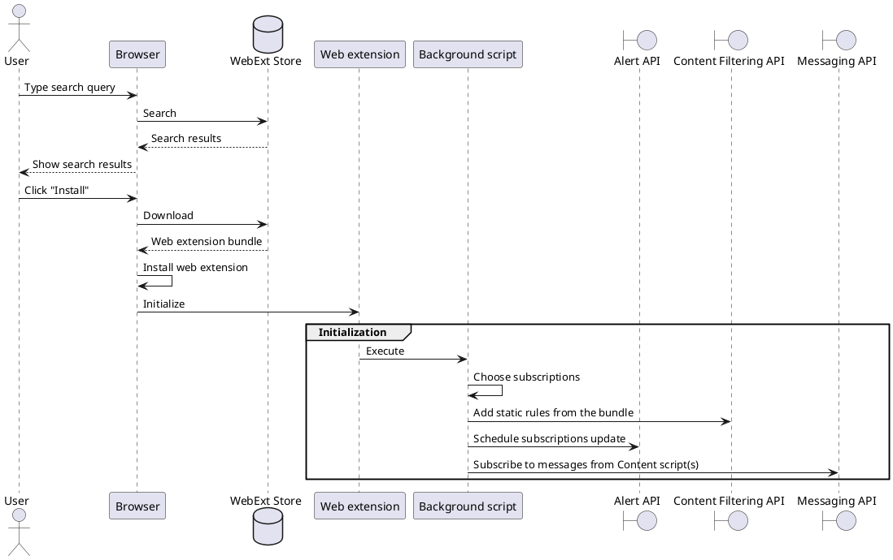
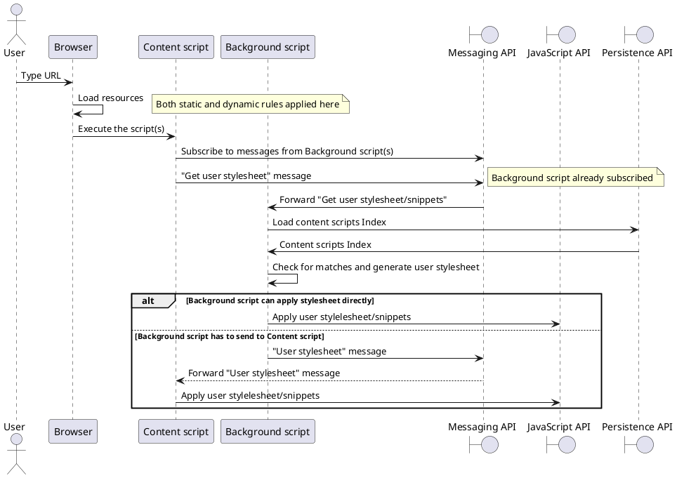
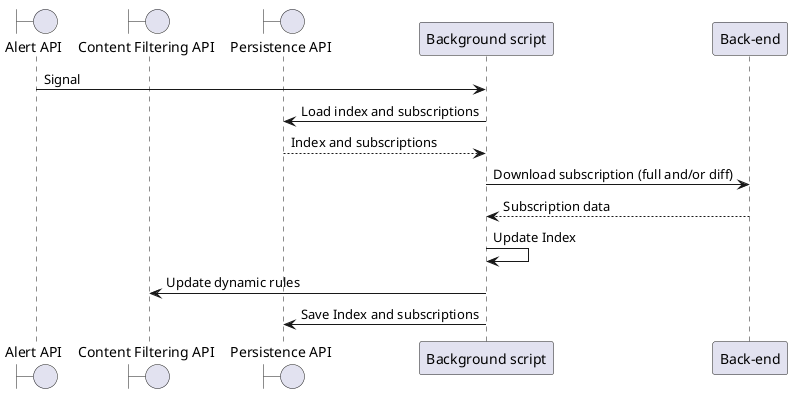

C4 model for Manifest V3 changes for ad blocking extension

# Architecture

## Context

**WebExt Core developers** provide a web extension SDK to **WebExt developers**. They use it in the ad blocking web extension and publish it to the **WebExt stores**. **Store moderators** review and approve the web extension updates. **Users** can search for an ad blocking extension and install it in desktop **Browser**. Once installed in the browser an ad blocking extension provides ad-filtered UX while navigating to the web sites. Browser extension keeps filter subscriptions up-to-date by requesting the updates from filters **Back-end** which is developed and supported by **Filter developers and Ops team**. Back-end fetches the changes from the **Public filter rules repositories** maintained by the **Filter authors**.

```plantuml
@startuml
!include https://raw.githubusercontent.com/plantuml-stdlib/C4-PlantUML/master/C4_Context.puml
!include https://raw.githubusercontent.com/plantuml-stdlib/C4-PlantUML/master/C4_Container.puml

LAYOUT_WITH_LEGEND()
title Context diagram

' persons
Person(user, "User", "Desktop users")
Person(coreDevs, "WebExt Core/SDK developers")
Person(webExtDevs, "WebExt developers")
Person(snippetDevs, "Snippets/ML developers")
Person(filterDevs, "Filter developers")
Person(ops, "Operations developers")
Person_Ext(filterAuthors, "Filter authors")
Person_Ext(storeModerators, "Store moderators")

' system itself
System(browser, "Desktop browser")
Container(webExt, "Web extension", "JavaScript", "Ad blocking web extension")
System(backEnd, "Filters back-end", "Filter subscriptions back-end")

' ext systems
System_Ext(webExtStore, "WebExt Stores", "eg. Chrome, FF, etc")
System_Ext(websiteHosting, "Websites hosting", "Hosts the websites")
ContainerDb_Ext(gitRepo, "Public filter rules repositories", "Git")

' relations
Rel_R(user, browser, "Searches a web extension, initiates a navigation")
Rel_U(browser, websiteHosting, "Navigates to web sites", "HTTP")
Rel_R(coreDevs, webExtDevs, "Provide web extension SDK")
Rel_U(snippetDevs, webExtDevs, "Provide snippets and ML model and lib")
Rel_U(webExtDevs, webExtStore, "Publish to")
Rel_R(webExtDevs, webExt, "Develop")
Rel_D(browser, webExtStore, "Installs a web extension from")
Rel_R(webExtStore, webExt, "Hosts")
Rel_D(browser, webExt, "Has installed")
Rel_U(storeModerators, webExt, "Review")
Rel(storeModerators, webExtStore, "Approve to")
Rel_U(filterDevs, backEnd, "Develop")
Rel_U(ops, backEnd, "Develop and maintain")
Rel_U(filterAuthors, gitRepo, "Publish subscriptions updates to")
Rel_R(webExt, backEnd, "Requests subscriptions updates from", "HTTP")
Rel_R(backEnd, gitRepo, "Fetches the changes from", "Git")
@enduml
```

## Containers

### Browser containers

As a deplayable thing a web extension is a single file. As a runnable thing a web extension is separated into **Content script** and webext **Background script** which are hosted in separate processes. Once installed a background script is executed as a *Service worker*. One a new page (tab) is loaded, a content script is injected into its context. Both scripts are able to communicate with Browser via public APIs (that are different for script type) and together via messages. Web extension (background script) fetches the changes from filters back-end.

```plantuml
@startuml
!include https://raw.githubusercontent.com/plantuml-stdlib/C4-PlantUML/master/C4_Context.puml
!include https://raw.githubusercontent.com/plantuml-stdlib/C4-PlantUML/master/C4_Container.puml
!include https://raw.githubusercontent.com/plantuml-stdlib/C4-PlantUML/master/C4_Component.puml

title Browser containers diagram
LAYOUT_WITH_LEGEND()

' system itself
System_Boundary(browserSystem, "Browser with web extension") {
  Container_Boundary(browserContainer, "Pure browser", "Native") {
    Component_Ext(browserCore, "Content filtering API", "Native")
    Component_Ext(browserApi, "Other API", "Native")
    Component_Ext(index, "Index", "Native")
    Component_Ext(matcher, "Matcher", "Native")
    Component_Ext(loader, "Resource loader", "Native")
    ContainerDb_Ext(persistence, "Persistence API", "Native")
    Component_Ext(schedulers, "Alert API", "Native")
  }

  Container_Boundary(webExtContainer, "Web Extension") {
    Container(webExtContent, "Content script", "JavaScript", "Associated with web page context")
    Container(webExtBackground, "Background script", "JavaScript", "Service worker")
  }
}

System_Boundary(backEndContainer, "Filters back-end") {
    Container(backEnd, "Server", "JavaScript")
}

' relations
Rel_U(webExtBackground, browserCore, "Request matched rules")
Rel_U(webExtBackground, browserCore, "Setup filter rules (DNR mark-up)")
Rel_U(webExtContent, browserApi, "Injects user stylesheet/CSS")
Rel_U(webExtBackground, persistence, "Persists the data in")
Rel_U(webExtBackground, schedulers, "Uses for scheduling")
Rel_U(browserCore, index, "Fills")
Rel_U(matcher, index, "Uses")
Rel_D(loader, matcher, "Allow load resource?")
Rel_L(matcher, browserCore, "Notifies matched rules")
Rel_D(webExtBackground, backEnd, "Fetches the changes from", "HTTP")
Rel_L(webExtBackground, webExtContent, "Communicates with")
@enduml
```

### Back-end containers

```plantuml
@startuml
!include https://raw.githubusercontent.com/plantuml-stdlib/C4-PlantUML/master/C4_Context.puml
!include https://raw.githubusercontent.com/plantuml-stdlib/C4-PlantUML/master/C4_Container.puml
!include https://raw.githubusercontent.com/plantuml-stdlib/C4-PlantUML/master/C4_Component.puml

title Back-end containers diagram
LAYOUT_WITH_LEGEND()

' system itself
System_Boundary(browser, "Browser with web extension") {
  Container(webExt, "Web extension", "JavaScript")
}

System_Boundary(backEndContainer, "Filters back-end") {
  Container(loadBalancer, "Load balancer", "")
  Container(host1, "Host 1", "")
  Container(hostN, "Host N", "")
  Container(filterServer, "Filters origin server", "")
}

ContainerDb_Ext(gitRepo, "Public filter rules repositories", "Git")

' relations
Rel_R(webExt, loadBalancer, "Fetches the changes from", "HTTP")
Rel_D(loadBalancer, host1, "Redirects to", "HTTP")
Rel_D(loadBalancer, hostN, "Redirects to", "HTTP")
Rel_D(host1, filterServer, "Get the data from")
Rel_D(hostN, filterServer, "Get the data from")
Rel_R(filterServer, gitRepo, "Fetches the changes from", "Git")
@enduml
```

## Components

### Web extension components

```plantuml
@startuml
!include https://raw.githubusercontent.com/plantuml-stdlib/C4-PlantUML/master/C4_Container.puml
!include https://raw.githubusercontent.com/plantuml-stdlib/C4-PlantUML/master/C4_Component.puml

title Web extension components diagram

' container itself
Container_Boundary(webext, "Web extension") {
  ' core  
  Component(analytics, "Analytics", "", "(?)")
  Component(events, "Events", "", "(essentially EventEmitter, wires the components")
  Component(filters, "Filters", "", "(whole classes hierarchy)")
  Component(easylistParser, "Easylist parser", "", "(essentially Filter.fromText())")
  Component(diffParser, "Diff parser", "", "MV3 diff")
  Component(synchronizer, "Synchronizer")
  Component(downloader, "Downloader")
  Component(dnrConverter, "DNR converter", "", "(converts filters to DNR mark-up")
  Component(matcher, "Matcher", "", "(Searches for filter matches)")
  Component(notifications, "Notifications", "", "(some events from the server)")
  Component(filterStorage, "Filter Storage", "", "(a mix of container and de-/serializer)")
  Component(prefs, "Preferences", "", "(de/-serializer for settings)")
  Component(snippets, "Snippets", "", "(?)")
  ' webext
  Component(firstRun, "First run", "", "(Onboarding)")
  Component(filterComposer, "Filter composer", "", "(?)")
  Component(options, "Options", "", "(?)")
  Component(popup, "Popup", "", "(?)")
  Component(devTools, "DevTools", "", "(?)")

  node index {
    Component(elemHide, "ElemHide + Exceptions")
    Component(elemHideEmu, "ElemHideEmulation")
    Component(snippets, "Snippets")
  }

  Container_Boundary(bundled_subscriptions, "Bundled subscriptions") {
    ComponentDb(sub1_dnr_rules, "Easylist rules", "(file in DNR mark-up)")
    ComponentDb(sub2_dnr_rules, "Easylist+Locale rules", "(file in DNR mark-up)")
  }
}

' external container
Container_Boundary(browser, "Pure browser", "") {
  ContainerDb_Ext(persistence, "Persistence API", "Native")
  Component_Ext(schedulers, "Alert API", "Native")
  Component_Ext(browserCore, "Content filtering API", "Native")
  Component_Ext(ui, "UI", "Native")
}

' external container
Container_Boundary(backEnd, "Filters back-end", "") {
  Container_Ext(server, "Server", "JavaScript")
}

' relations
Rel(synchronizer, downloader, "Uses")
Rel(synchronizer, easylistParser, "Uses")
Rel_U(synchronizer, diffParser, "Uses")
Rel_U(synchronizer, schedulers, "Schedules subscriptions/notifications updates")
Rel(synchronizer, dnrConverter, "Uses")
Rel_U(synchronizer, browserCore, "Feeds with dynamic + static rules")
Rel(synchronizer, bundled_subscriptions, "Uses")
Rel(easylistParser, filters, "Instantiates")
Rel(easylistParser, index, "Fills")
Rel(index, filters, "Contains")
Rel_U(index, persistence, "Is persisted in")
Rel(downloader, server, "Downloads from")
Rel_U(matcher, index, "Uses")
Rel(notifications, downloader, "Uses")
Rel(filterStorage, persistence, "Uses")
Rel(prefs, persistence, "Uses to feed static rules")
Rel(ui, firstRun, "Show")
Rel(ui, filterComposer, "Show")
Rel(ui, options, "Show")
Rel(ui, popup, "Show")
Rel(ui, devTools, "Show")
@enduml
```

### Back-end components

TBD later.

## Code

TBD later.

# Use cases

## Web extension installation



## Page navigation



## Subscription update



# Open questions

* Should we show Enterprise boundaries? Adblock Inc. - external/internal?
* WebExt on Containers diagram: split into separate containers (runnable things - Content/Background ) or keep single (single deployable thing)?
* Browser on Containers diagram: keep Browser detailed (components)? Describe Chrome processes (main, child, extension)?
* Filters origin server: show processes?
* Separate Core and WebExt SDK?

# TODO

* Close open questions
* Review and discuss together with teams
* Describe Components and Code as we go.
